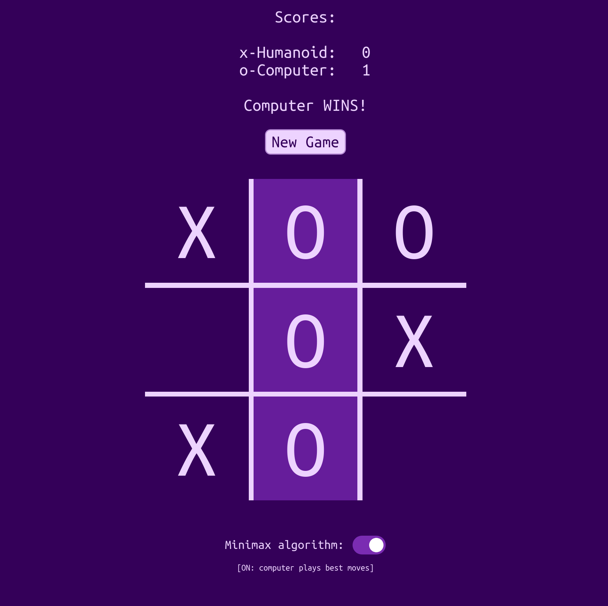

# ticTacToe
Tic tac toe in the browser: practice with JavaScript objects and factory functions

Simon Tharby's solution to [Project: Tic Tac Toe](https://www.theodinproject.com/courses/javascript/lessons/tic-tac-toe-javascript?ref=lnav), Organizing JavaScript Code section, Javascript unit, Odin Project.

[View in browser](https://jinjagit.github.io/ticTacToe/)

  * Includes minimax algorithm (toggle-able): Adapted from [this freecodecamp article](https://medium.freecodecamp.org/how-to-make-your-tic-tac-toe-game-unbeatable-by-using-the-minimax-algorithm-9d690bad4b37)
  * Minimax on == computer will randomly select from > 1 equivalently 'best' moves
  * Minimax off == computer will randomly chose from all empty grid cells

### Screenshot:

### Getting started:

To get started with the app, clone / download the repo and open index.html in a browser.
